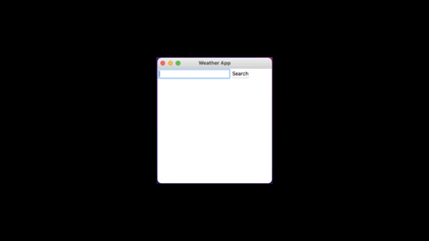

# Weatherapp

This weather app will tell you about the current weather in your city. This is done by an API, which pulls information from a website called ‘openweathermap.org’. The information is converted in to JSON, and the needed information is printed to the user. In this app you will be able to type in your city and click on the search button. You will then be shown a picture of the current weather, along the weather high and low temperature, and a brief description of the weather. 

For this app I used three modules ‘Tkinter’, ‘requests’, and ‘json’. The tkinter module was used to create the window to display the given weather information, there is a ‘Search’ button which is used to grab the information about weather in the area. The requests module is used to grab the information from the website ‘openweathermap.org’, which is then converted in to JSON. The JSON module is used to pull the information and turn it into a dictionary, this will then be printed to the user.

An example of the code is below:

